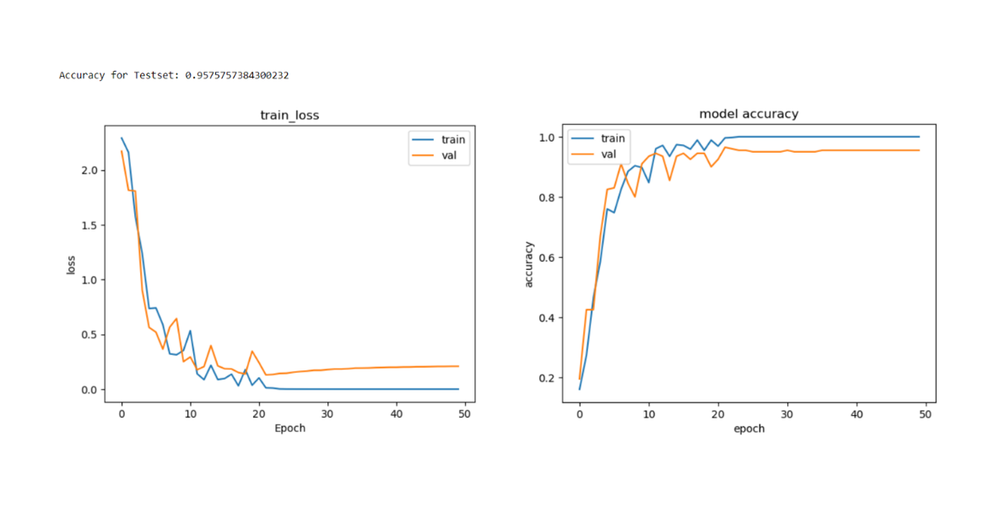

# Project3
 Image recognition
# Project Overview
Title: Enhanced Digit Recognition Model

Objective: To develop a highly accurate image recognition model capable of identifying handwritten digits from 0 to 9.

Step file: 009_Image_recognition.pdf.

# Step Summary
•	Model Architecture Setup: Utilized a sequential neural network model with multiple convolutional layers to effectively capture spatial hierarchies in images.

•	Layer Configuration:

     Convolutional Layers: Configured three convolutional layers to extract features from the input images.

     Pooling Layers: Integrated MaxPooling layers to reduce the dimensionality of the feature maps, aiding in the reduction of computational complexity and overfitting.

     Dense Layers: Added dense layers, increasing the number of neurons to 256, to enhance the learning capacity.

•	Optimization Strategy: Switched to the Adam optimizer, known for its adaptive learning rate capabilities, which helped in faster convergence.

•	Data Augmentation: Implemented various data augmentation techniques including rotation and brightness adjustments to simulate a diverse range of handwriting styles and improve model robustness.

# Performance Enhancements

•	Epoch Adjustments: Increased the number of training epochs from 15 to 60, allowing the model more iterations to thoroughly learn from the augmented data.

•	Accuracy Achievements: Through systematic tuning and enhancements, the model’s accuracy was boosted significantly from an initial 71.0% to a commendable 95.7%.

